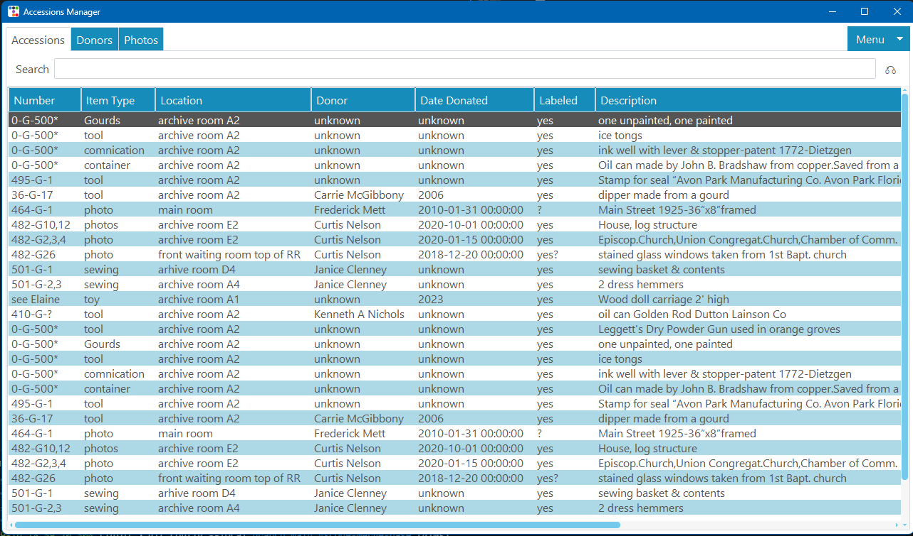

# Accessions Manager
> Museum accessions management software

One to two paragraph statement about your product and what it does.



## Dev Setup

Install all libraries in requirements.text

```sh
pip install -r requirements.text
```

## Meta

Michael Joseph Miller
- X: [@mjmiller41](https://twitter.com/dbader_org)
- Email: michael.joseph.miller@gmail.com
- GitHub: [https://github.com/mjmiller41](https://github.com/mjmiller41/) 

Distributed under the MIT license. See ``LICENSE.txt`` for more information.

## Contributing

1. Fork it (<https://github.com/mjmiller41/accessions-manager.git/fork>)
2. Create your feature branch (`git checkout -b feature/fooBar`)
3. Commit your changes (`git commit -am 'Add some fooBar'`)
4. Push to the branch (`git push origin feature/fooBar`)
5. Create a new Pull Request

<!-- Markdown link & img dfn's -->
[wiki]: https://github.com/mjmiller41/accessions-manager.git/wiki
[email]: michael.joseph.miller@gmail.com